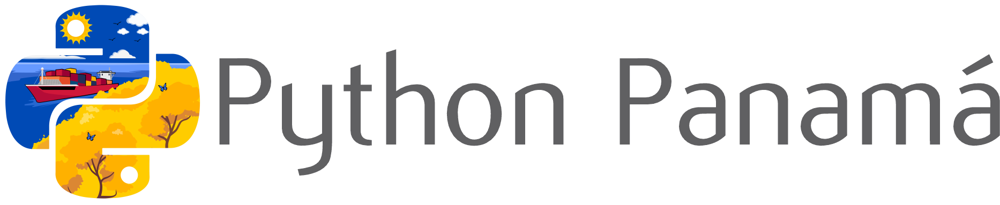

# Python Panamá - Sitio Web Oficial

[](https://github.com/pythonpanama/python_panama_website/issues)
[](https://github.com/pythonpanama/python_panama_website/stargazers)



## 📄 Descripción

Sitio web oficial de la comunidad Python Panamá, desarrollado por y para la comunidad. Este proyecto tiene como objetivo proporcionar un punto central de información sobre eventos, recursos, tutoriales y noticias relacionadas con Python en Panamá.

## ✨ Características

- 🌐 Sitio web completamente responsivo
- 📅 Información de eventos e iniciativas de la comunidad
- 📚 Recursos educativos de Python
- 📰 Blog con noticias y tutoriales
- 🤝 Página de patrocinadores
- 🧭 Página de Python Route
- 🔄 Integración con redes sociales

## 🛠️ Tecnologías

- **Frontend**: React 18, TypeScript, Vite
- **Routing**: React Router DOM
- **Estilos**: Bootstrap 5, Font Awesome, CSS personalizado
- **Build tooling**: TypeScript, ESLint, Vite

## 📋 Prerrequisitos

- Git
- Node.js 18+
- npm

## 🚀 Instalación

1. **Clonar el repositorio**

```bash
git clone https://github.com/pythonpanama/python_panama_website.git
cd python_panama_website
```

2. **Instalar dependencias**

```bash
npm install
```

3. **Ejecutar servidor de desarrollo**

```bash
npm run dev
```

El sitio estará disponible en la URL local que indique Vite, normalmente http://localhost:5173/.

## 📦 Comandos disponibles

Ejecutar el entorno de desarrollo:

```bash
npm run dev
```

Generar build de producción:

```bash
npm run build
```

Previsualizar el build localmente:

```bash
npm run preview
```

Ejecutar lint:

```bash
npm run lint
```

## 👥 Cómo contribuir

¡Nos encantaría que contribuyeras! Puedes abrir un issue o enviar un pull request con mejoras al sitio, contenido, estilos o documentación.

## 📝 Código de Conducta

Este proyecto sigue el código de conducta publicado en la sección `/codigo-de-conducta` del sitio. Al participar, se espera que respetes este código.

## 🗺️ Mapa del sitio

- **/** - Página principal
- **/codigo-de-conducta** - Código de conducta de la comunidad
- **/patrocinadores** - Patrocinadores
- **/blog** - Noticias y tutoriales
- **/python-route** - Información de Python Route
- **/contacto** - Redes sociales y canales oficiales

## 🔗 Enlaces útiles

- [Sitio oficial de Python Panamá](https://python.pa/)
- [Twitter de Python Panamá](https://twitter.com/pythonpanama)
- [Canal de Discord](https://discord.gg/pythonpanama)
- [Grupo de Meetup](https://www.meetup.com/python-panama/)

## 👏 Agradecimientos

- A todos los contribuidores que han ayudado a construir este proyecto
- A la [Python Software Foundation](https://www.python.org/psf/) por su apoyo
- A la comunidad global de Python por su inspiración
